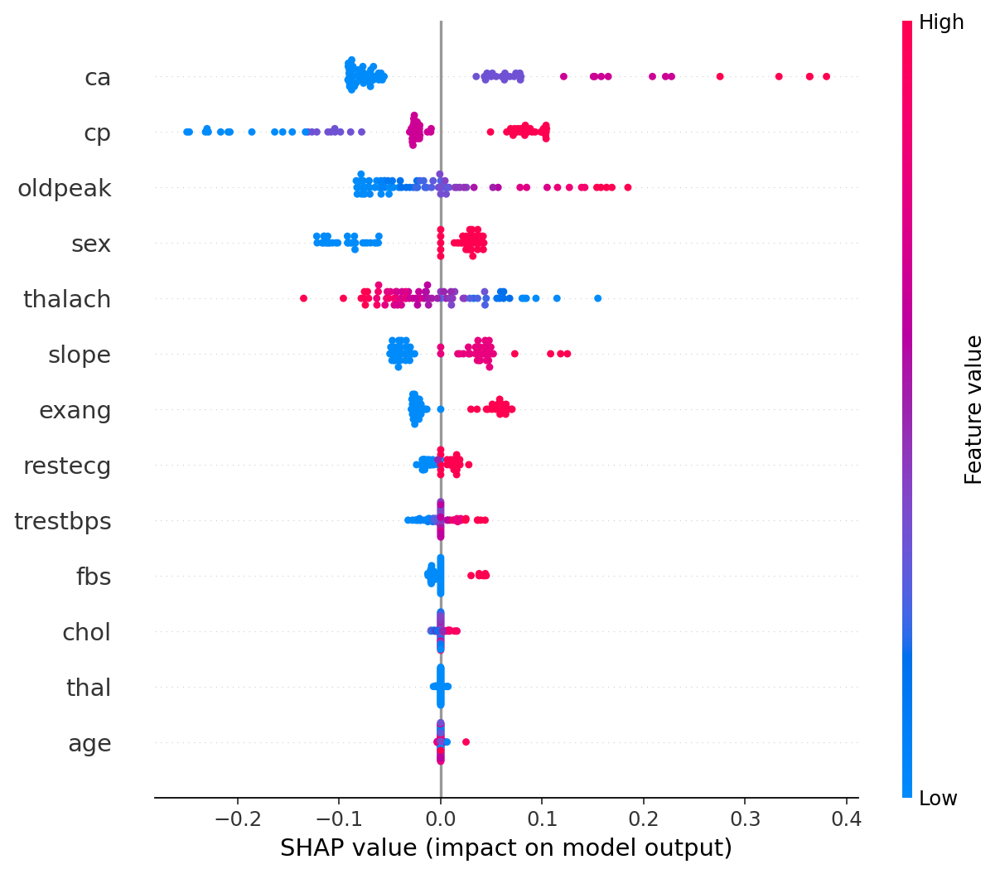

# Healthcare Risk Prediction (Heart Disease) — No-Widget Static Pipeline

[](https://github.com/chibuogwuonyemaechi/healthcare_risk_prediction/releases)

A clean, reproducible ML workflow for heart-disease risk prediction:

- **EDA:** distributions + correlation heatmap (saved as PNG)
- **Model selection:** Logistic Regression, Random Forest, optional XGBoost (auto-select best by CV ROC AUC)
- **Evaluation:** ROC AUC, PR AUC, confusion matrix, classification report
- **Explainability:** SHAP summary + top features exported as high-res PNG/SVG (no Jupyter widgets)

Main script: [healthcare_risk_prediction_static.py](./healthcare_risk_prediction_static.py)

## Artifacts (saved to outputs/)

- eda_distributions.png, corr_matrix.png
- roc_pr_curves.png, confusion_matrix.png
- shap_summary.png + .svg, shap_top_features.png + .svg
- metrics.json

### Results (sample)

<p>  </p> <p>  </p>
<p>  </p>  <p>  </p>  <p>  </p> <p>  </p>

### Headline numbers (example)

- CV ROC AUC (LogReg winner): 0.903
- Test ROC AUC: 0.926
- Test PR AUC: 0.812

### Notes

- Fully static pipeline (no notebook widgets) → easy to run, zip, and share.
- If xgboost is hard to install on your system, remove it from requirements.txt — the script falls back to LogReg/RF.
- Deterministic by default (seed=42).

### License

MIT

## Quickstart
```bash
- conda create -n heartds python=3.10 -y
- conda activate heartds
- pip install -r requirements.txt
- python healthcare_risk_prediction_static.py
